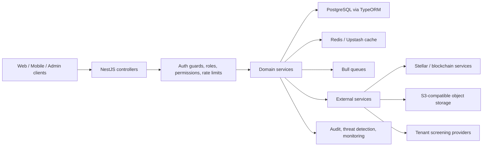
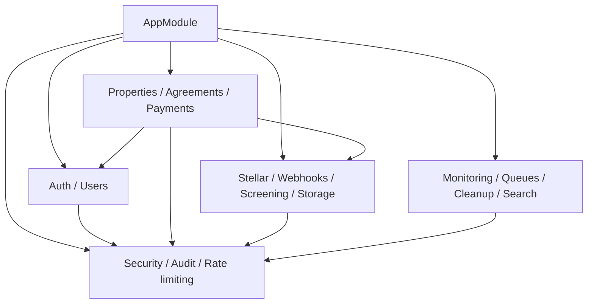
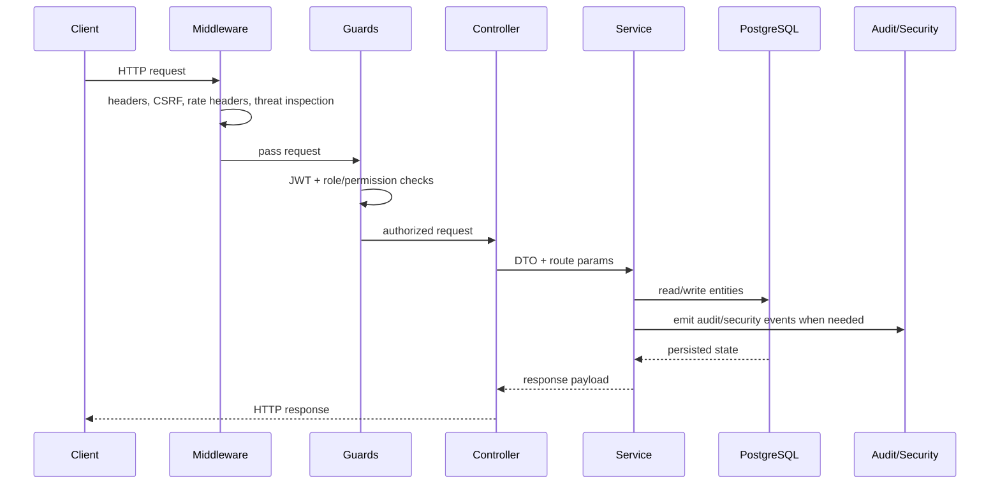
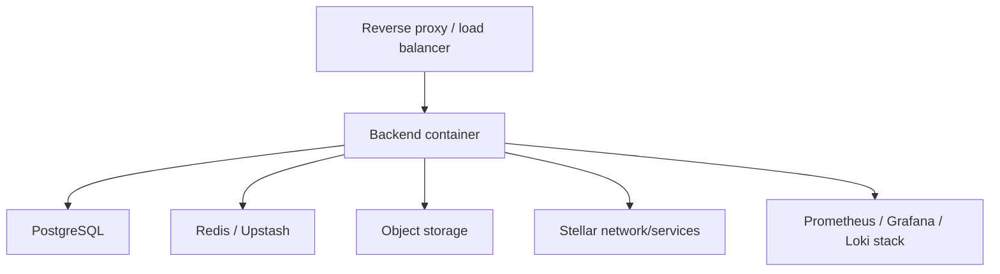

# Architecture Documentation

## System Overview

Chioma backend is a NestJS modular monolith that serves REST APIs, background
processing, security monitoring, blockchain integrations, and operational
tooling from one deployable service. The architecture is intentionally layered:

- controllers handle transport concerns and request validation
- services hold business logic
- repositories and TypeORM entities provide persistence
- middleware and guards enforce cross-cutting concerns
- background jobs and external integrations handle asynchronous workflows

## High-Level Architecture

## Layered Architecture

### Presentation layer

- NestJS controllers expose route handlers, Swagger metadata, and DTO mapping.
- Global `ValidationPipe` standardizes request validation.
- `AllExceptionsFilter` normalizes error handling.

### Security and policy layer

- `JwtAuthGuard` enforces authenticated access.
- `RolesGuard` enforces coarse role membership.
- `PermissionsGuard` and `RbacService` provide fine-grained permission support.
- middleware applies security headers, request size limits, CSRF protection,
  rate-limit headers, localization, and threat detection.

### Domain layer

The service layer is grouped by functional modules such as:

- `agreements`, `payments`, `properties`, `users`, `notifications`
- `security`, `audit`, `screening`, `webhooks`, `queues`
- `stellar`, `developer`, `maintenance`, `reviews`, `subletting`

### Persistence layer

- PostgreSQL is the system-of-record.
- TypeORM entities live under `backend/src/modules/**/entities`.
- migrations are executed through `backend/src/database/data-source.ts` and the
  safe migration runner.

## Module Structure

### Current module inventory

`agreements`, `ai`, `audit`, `auth`, `cleanup`, `developer`, `disputes`,
`feedback`, `i18n`, `inquiries`, `kyc`, `maintenance`, `messaging`,
`monitoring`, `notifications`, `payments`, `profile`, `properties`, `queues`,
`rate-limiting`, `referral`, `rent`, `reviews`, `screening`, `search`,
`security`, `stellar`, `storage`, `subletting`, `transactions`, `users`,
`webhooks`.

### Dependency guidance

## Design Patterns in Use

| Pattern                   | Where it appears                                       | Purpose                                                 |
| ------------------------- | ------------------------------------------------------ | ------------------------------------------------------- |
| Modular monolith          | `AppModule` imports domain modules                     | Keep delivery simple while preserving domain boundaries |
| Dependency injection      | Nest providers throughout the codebase                 | Loose coupling and testability                          |
| Repository pattern        | TypeORM repositories injected into services            | Persistence abstraction                                 |
| Decorator-based policy    | `@Roles`, Swagger decorators, audit decorators         | Declarative security and documentation                  |
| Middleware chain          | security headers, CSRF, localization, threat detection | Consistent cross-cutting policy enforcement             |
| Event/audit trail pattern | `audit_logs`, `security_events`, `threat_events`       | Compliance, observability, forensics                    |
| Queue/offload pattern     | Bull queues and async processors                       | Remove slow work from request path                      |

## Request and Data Flow

## Integration Points

- PostgreSQL for transactional state
- Redis or Upstash for cache-backed acceleration
- Bull queues for asynchronous processing
- Stellar services for accounts, escrows, indexed transactions, and audit anchoring
- S3-compatible storage for files
- tenant screening providers, webhook consumers, AWS Secrets Manager, and Sentry

## Deployment Architecture

Supporting files already present in the repository:

- `backend/Dockerfile`
- `backend/Dockerfile.production`
- `backend/docker-compose.yml`
- `backend/docker-compose.production.yml`
- `backend/docker-compose.monitoring.yml`
- `backend/nginx/nginx.conf`

## Scalability and Performance

- stateless API nodes can scale behind a load balancer
- cache and queue infrastructure absorb repeated and asynchronous workloads
- PostgreSQL and Redis can scale vertically before a service split is needed
- audit, threat, and transaction tables should be watched closely as event
  volume grows

## Security Architecture

Security is layered rather than delegated to a single module:

- request middleware handles headers, CSRF, request size, and threat analysis
- guards enforce authentication and authorization
- encryption services protect sensitive data and keys
- audit and security event tables provide accountability and detection
- compliance services turn telemetry into operational reporting
