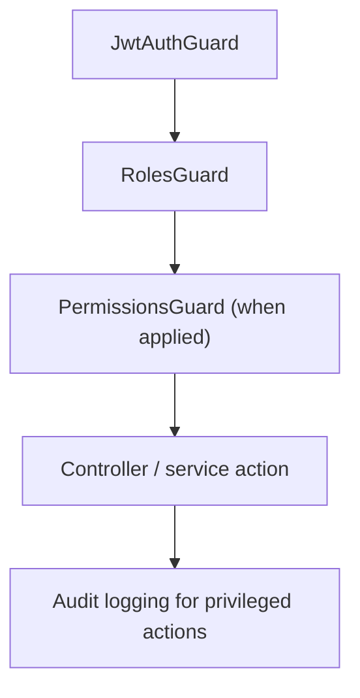
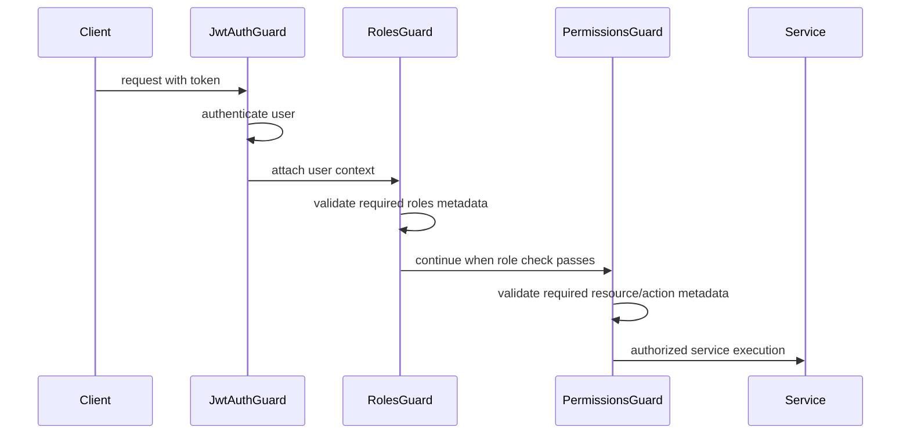

# Authorization Documentation

## Overview

Chioma backend uses layered authorization with:

- role-based access control at the route level
- a permission catalog for finer-grained resource/action rules
- audit logging around privileged changes

## Authorization Model



Current state in code:

- `RolesGuard` is the primary route-level authorization mechanism in active use.
- `RbacService` owns the default permission matrix for system roles.
- `PermissionsGuard` and `@RequirePermission(...)` are available for granular enforcement.

## Role Definitions

### Application user roles

| Role       | Typical responsibility                            |
| ---------- | ------------------------------------------------- |
| `user`     | General authenticated user                        |
| `tenant`   | Tenant-facing workflows                           |
| `landlord` | Listing, agreement, and property owner workflows  |
| `agent`    | Agent-specific platform activity                  |
| `admin`    | Administrative access to backend control surfaces |

### RBAC system roles

| System role   | Intent                                              |
| ------------- | --------------------------------------------------- |
| `super_admin` | Full access to all defined resources and actions    |
| `admin`       | Broad platform operations and oversight             |
| `auditor`     | Read/export access for audit, reporting, and review |
| `support`     | Limited support and dispute assistance              |
| `landlord`    | Property and agreement management privileges        |
| `tenant`      | Tenant payment, agreement, and dispute privileges   |
| `user`        | Basic read-only application access                  |

## Permission Management

### Permission resources

- `users`
- `properties`
- `agreements`
- `payments`
- `disputes`
- `audit`
- `security`
- `notifications`
- `kyc`
- `admin`
- `reports`
- `blockchain`
- `storage`

### Permission actions

- `create`
- `read`
- `update`
- `delete`
- `execute`
- `export`
- `manage`

`manage` acts as a superset action in the current `RbacService` implementation.

## Default Role-to-Permission Matrix

| Role          | Access summary                                                                                              |
| ------------- | ----------------------------------------------------------------------------------------------------------- |
| `super_admin` | All resources, all actions                                                                                  |
| `admin`       | Broad user, property, agreement, payment, dispute, KYC, notification, audit, security, and reporting access |
| `auditor`     | Read/export-heavy access to audit, reports, security, payments, and agreements                              |
| `support`     | User read access, dispute read/update, notification create                                                  |
| `landlord`    | Property CRUD, agreement create/read/update, payment read, dispute create/read                              |
| `tenant`      | Property read, agreement read, payment create/read, dispute create/read                                     |
| `user`        | Basic read access to properties and users                                                                   |

## Access Control Lists and Enforcement Guidance

### Route-level ACLs

```ts
@UseGuards(JwtAuthGuard, RolesGuard)
@Roles(UserRole.ADMIN)
```

Use this for broad areas such as security dashboards, audit review, and
privileged operational endpoints.

### Fine-grained ACLs

```ts
@UseGuards(JwtAuthGuard, PermissionsGuard)
@RequirePermission(PermissionResource.PAYMENTS, PermissionAction.READ)
```

Use this when multiple roles may access the same resource with different action
scopes.

## Authorization Flow



## Implementation Guidelines

1. Decide whether role-based restriction is enough for a new endpoint.
2. If the operation is sensitive or shared by several roles, define a permission resource/action pair.
3. Apply the relevant guard and decorator.
4. Keep the UI and API documentation aligned with the backend rule.
5. Add audit logging for privileged or security-sensitive changes.

## Best Practices

- default to least privilege
- prefer explicit permission names over catch-all semantics
- keep application `UserRole` checks and RBAC `SystemRole` definitions aligned
- audit administrative seeding, permission changes, and sensitive access paths
- avoid burying authorization logic inside controllers when guards and decorators provide a cleaner contract

## Examples

```ts
@Get('security/events')
@UseGuards(JwtAuthGuard, RolesGuard)
@Roles(UserRole.ADMIN)
async getSecurityEvents() {
  return this.securityEventsService.getRecentEvents();
}
```

```ts
@Get('reports/export')
@UseGuards(JwtAuthGuard, PermissionsGuard)
@RequirePermission(PermissionResource.REPORTS, PermissionAction.EXPORT)
async exportReport() {
  // ...
}
```

## Troubleshooting

### Authenticated user still gets `403`

- confirm the route uses the expected guard
- verify the user object includes the expected `role`
- ensure the required role matches the decorator metadata
- if using permissions, confirm the role matrix includes the resource/action

### Permission-based routes always fail

- make sure `PermissionsGuard` is actually applied
- verify `@RequirePermission(...)` metadata is present
- confirm the role-to-permission matrix has been updated and seeded

### Admin UI and backend rules disagree

- compare frontend feature gating with backend decorators
- review seeded RBAC data against `RbacService.defaultPermissions`
- update docs and admin screens together when permission rules change
